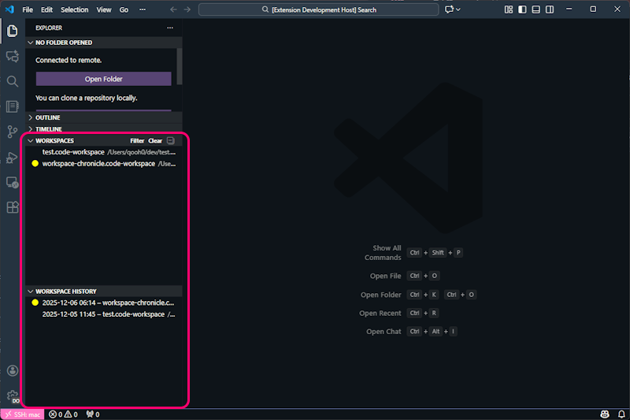
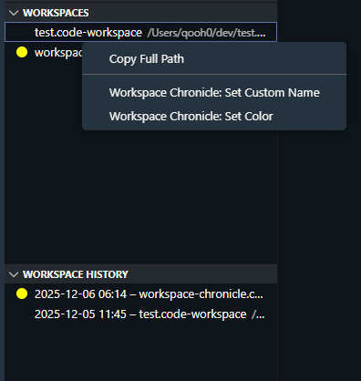
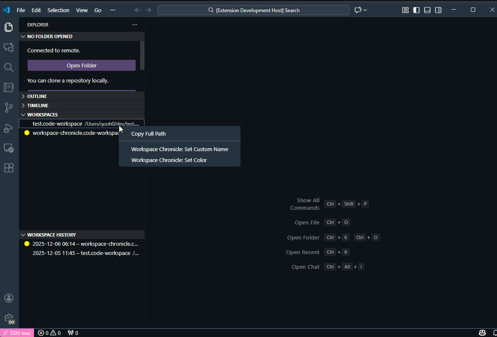
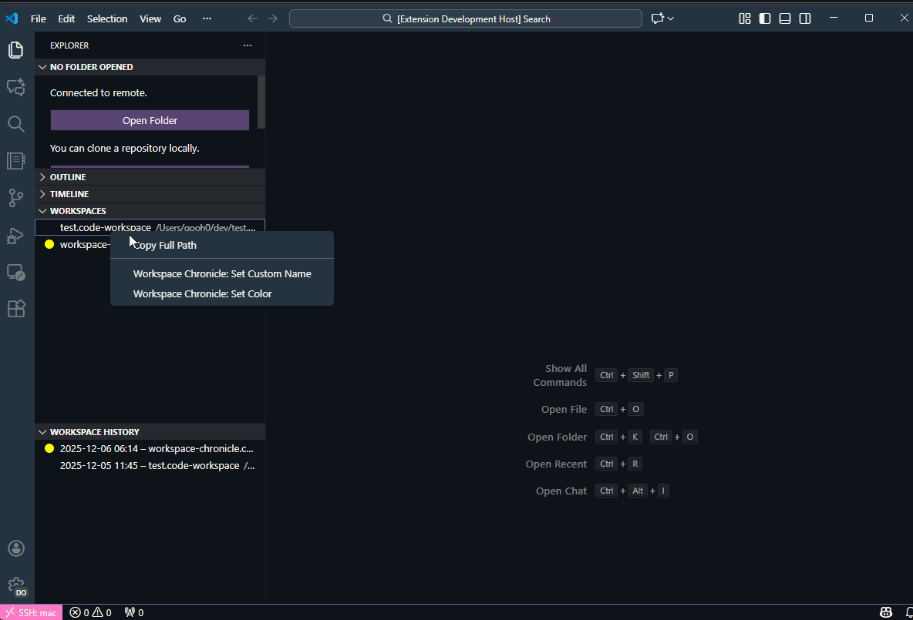
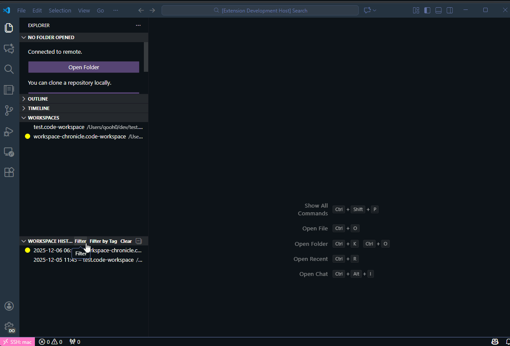

# Workspace Chronicle

多数の `.code-workspace` を収集して一覧表示し、**新規ウィンドウ（既定）**または**既存ウィンドウ**で開けます。開いた履歴を記録・表示します。

[English](README.en.md)

<!-- GitHub CI / Release -->

<!-- License / PR welcome -->

---

## What's this?

Visual Studio Code で仕事している人向けに、以下の要望を解決するツールです。

- プロジェクトに一発で移動したい
- 急なプロジェクト変更に対応したい
- 最近開いたワークスペースをすぐに見つけたい
- 複数のプロジェクトを頻繁に切り替えたい

---

## スクリーンショット

### Workspace 名で右クリックをしたときに表示されるコマンド

### 名称(label)の変更

### 色の変更

### ヒストリーでの逐次検索

---

## インストール

### VS Code Marketplace から
1. VS Code を開く
2. 拡張機能パネル（`Ctrl+Shift+X` / `Cmd+Shift+X`）を開く
3. `Workspace Chronicle` を検索
4. **Install** をクリック

> おすすめ: [Auto Workspace Creator](https://marketplace.visualstudio.com/items?itemName=nickmcdowall.auto-workspace) と併用すると、ワークスペースファイルの自動生成もできて便利です。

---

## Quick Start

1. 設定 → `workspaceChronicle.roots` に `.code-workspace` を探索するフォルダを追加
2. サイドバーの `Workspaces` / `Workspace History` ビューから一覧を開く
3. 任意の項目をクリック → 新規ウィンドウで開く（既定設定）
4. 再度開くと履歴が自動的に更新されます

---

## 機能

| 機能 | 説明 |
|------|------|
| **Workspaces ビュー** | 指定ルート配下から `.code-workspace` を自動探索・一覧表示 |
| **Workspace History ビュー** | 開いた日時・モードを履歴として表示 |
| **開き方の選択** | 新規ウィンドウ（既定）または既存ウィンドウで開く |
| **ラベル/色タグ** | ワークスペースにラベルや色を付けて整理 |
| **フィルター機能** | 名前・ラベル・色でワークスペースや履歴を絞り込み |
| **クイックオープン** | コマンドパレットから素早くワークスペースを検索・開く |
| **エクスポート/インポート** | メタデータと履歴をJSONファイルでバックアップ・復元 |

---

## 設定

| 設定項目 | 説明 | デフォルト |
|----------|------|------------|
| `workspaceChronicle.roots` | 探索するルートディレクトリ | `["${userHome}"]` |
| `workspaceChronicle.defaultOpenMode` | 既定の開き方 (`newWindow` / `reuseWindow`) | `newWindow` |
| `workspaceChronicle.historyLimit` | 保存する履歴の最大件数 | `500` |
| `workspaceChronicle.scanTimeoutMs` | スキャンのタイムアウト（ミリ秒）。時間内に見つかった結果を表示します | `30000` |
| `workspaceChronicle.scanWhenWorkspaceFileOpen` | `.code-workspace`（マルチルート）を開いている状態でも探索します | `true` |
| `workspaceChronicle.scanWhenNoFolderOpen` | フォルダ未オープン（空ウィンドウ）の状態でも探索します | `true` |
| `workspaceChronicle.scanUseDefaultIgnore` | 組み込みの除外パターン（node_modules / ビルド成果物など）を使用 | `true` |
| `workspaceChronicle.scanIgnore` | 追加の除外 glob（例: `**/go/pkg/**`, `**/pkg/mod/**`） | `[]` |
| `workspaceChronicle.scanRespectGitignore` | `.gitignore` を読み取り、ignore されているパスは探索しない | `true` |
| `workspaceChronicle.scanStopAtWorkspaceFile` | 同一ディレクトリに `.code-workspace` があれば配下は探索しない | `true` |
| `workspaceChronicle.scanUpdateIntervalMs` | 探索中にツリーを更新する間隔（ミリ秒） | `500` |

### 注意

- 探索対象は `workspaceChronicle.roots` 配下です（今開いているプロジェクトフォルダ配下を自動探索する仕様ではありません）。ビューを開いて拡張が有効化されていれば、空ウィンドウでも探索します。
- 空ウィンドウでは探索したくない場合は `workspaceChronicle.scanWhenNoFolderOpen` を `false` にしてください。
- Windows では `AppData` 配下は既定で探索対象外です（サイズが大きくノイズになりやすいため）。
- `workspaceChronicle.roots` が広すぎる（例: `${userHome}`）場合、探索に時間がかかることがあります。roots を絞るか、除外設定を追加してください。
- `.gitignore` 対応は roots 配下で見つかった `.gitignore` を読み取って適用します。現時点では global gitignore や `.git/info/exclude` は対象外です。

---

## データの保存場所

履歴とメタデータは OS ごとに次の場所へ保存されます。

- Windows: `%APPDATA%\workspace-chronicle\`
- macOS: `~/Library/Application Support/workspace-chronicle/`
- Linux: `~/.local/share/workspace-chronicle/`

---

## コマンド

| コマンド | 説明 |
|----------|------|
| `Workspace Chronicle: Refresh` | ワークスペース一覧を更新 |
| `Workspace Chronicle: Set Default Open Mode` | 既定の開き方を設定 |
| `Workspace Chronicle: Set Custom Name` | カスタム名（ラベル）を設定 |
| `Workspace Chronicle: Set Color` | 色タグを設定 |
| `Workspace Chronicle: Filter by Label or Color` | Workspaces をラベル/色でフィルター |
| `Workspace Chronicle: Filter History` | 履歴をキーワードでフィルター |
| `Workspace Chronicle: Filter History by Label or Color` | 履歴をラベル/色でフィルター |
| `Workspace Chronicle: Toggle Sort Mode` | 履歴のソートモードを切り替え |
| `Workspace Chronicle: Clear All Filters` | すべてのフィルターをクリア |
| `Workspace Chronicle: Open Recent` | 最近開いたワークスペースをクイックオープン |
| `Workspace Chronicle: Search Workspaces` | ワークスペースを検索して開く |
| `Workspace Chronicle: Export Data` | メタデータと履歴をエクスポート |
| `Workspace Chronicle: Import Data` | メタデータと履歴をインポート |
| `Workspace Chronicle: Add Root Directory` | ルートディレクトリを追加 |
| `Workspace Chronicle: Remove Root Directory` | ルートディレクトリを削除 |
| `Workspace Chronicle: List Root Directories` | ルートディレクトリ一覧を表示 |

---

## 貢献

Issue や Pull Request を歓迎します！

- バグ報告: [Issues](https://github.com/qadiff/workspace-chronicle/issues)
- 機能リクエスト: [Issues](https://github.com/qadiff/workspace-chronicle/issues)
- コード貢献: [Pull Requests](https://github.com/qadiff/workspace-chronicle/pulls)

このプロジェクトが役に立ったら、ぜひ **Star** をお願いします！

---

## LICENSE

This project is licensed under the Apache License 2.0 - see the [LICENSE](LICENSE) file for details.
